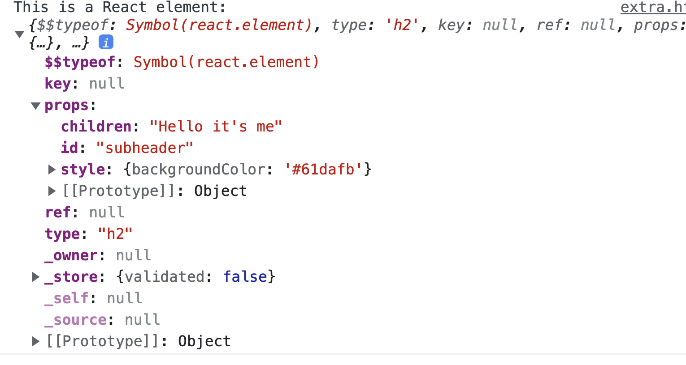
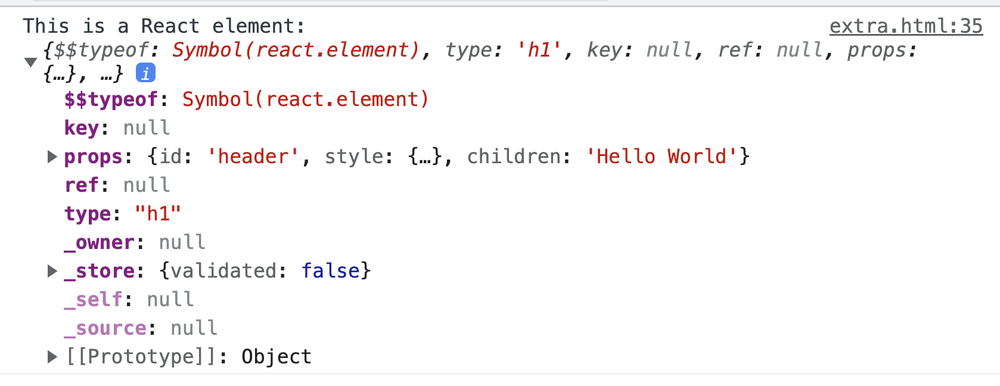

## Exercise

- [Exercise](components.html)

So far we have created React elements and appended them to the DOM use `React.DOM`. The real strength of React is it's component driven architecture. Let's convert this to use React components!

In modern applications you'll get React and React DOM files from a "package
registry" like [npm](https://npmjs.com) ([react](https://npm.im/react) and
[react-dom](https://npm.im/react-dom)). But for these first exercises, we'll use
the script files which are available on [unpkg.com](https://unpkg.com) and
regular script tags so you don't have to bother installing them. So in the
exercise you'll be required to add script tags for these files.

Once you include the script tags, you'll have two new global variables to use:
`React` and `ReactDOM`.

Here's a succent example of creating a component in React:

```javascript
function component({ text }) {
  return React.createElement("h1", null, text);
}

const h1 = React.createElement(
  component,
  { text: "Hello World" } // 👈 props
);

ReactDOM.render(h1, document.getElementById("root"));
```

---
## Recap

```js
React.createElement(type, [props], [...children]);
```

`React.createElement()` can accept, as its first argument (type), either a string or a function. If the type is a string, React knows that the element it creates will ultimately become a DOM node. if the type is a function, React DOM knows that to create a React component.

React components opens doors to powerful functionality, such as state, which we will see later.

---
## Arguments

The first argument to `React.createElement()` has to be a string or a function. In order to pass arguments to a React component, we leverage `React.createElement()`s second arguments: `props`.

```js
React.createElement(type, [props], [...children]);
```

- `props`: A configuration object (example: {id: 'root'}) used to configure the element (i.e. set attributes) or function component.

When the first argument passed to React.createElement() is a function, React will take the second argument -- "props" -- and pass it to the function as the only parameter. Remember, this has to be an object. This is how we pass arguments into React components.

## Components with props (_we will discuss props in more depth in a future lesson_)

We discussed earlier that props are to React elements what arguments are to HTML elements. Similarly, props are to components what arguments are to functions.

Example of props with React Elements (_the following are two example of writing props - both are the same_):

```js
const h2 = React.createElement(
  "h2",
  {
    id: "subheader",
    style: {
      backgroundColor: "#61dafb",
    },
  },
  "Hello it's me"
);

console.log(`This is a React element: `, h2);
```



```js
const h1 = React.createElement("h1", {
  id: "header",
  style: {
    backgroundColor: "#61dafb",
  },
  children: "Hello World",
});
console.log(`This is a React element: `, h1);
```


Example of props with React Components: 

```js
// example 1
function component({text}) {
  return React.createElement('h1', null, text)
}

const h1 = React.createElement(
  component({text: 'Hello World'})
);

ReactDOM.render(h1, document.getElementById('root'))
```

```js
// example 2
   // note this components is accepting a props object with a key `children` and we've destructured the `props` object here 
   function message({children}) {
      return <div className="message">{children}</div>
    }

    const element = (
      <div className="container">
        {message({children: 'Hello World'})}
        {message({children: 'Goodbye World'})}
      </div>
    )

    ReactDOM.createRoot(document.getElementById('root')).render(element)
```

Alright! Let's do this! Head over to the exercise. 

- [Exercise](components.html)
## Extra Credit

### 1. 💯 composition

One of the major advantages of functional programming is the ability to compose functions. The idea of function composition is that the result of one function is passed as the argument to the next. This allows us to create complicated functions that are just composed of smaller, simpler ones.

Consider the following JavaScript snippet:

```js
function double(x) {
  return x * 2;
}

function square(x) {
  return x * x;
}

const output1 = double(2);
const output2 = square(output1);
console.log(output2);
```

The above snippet is a traditional approach, and it works great! However, take a look at what we can do if we leverage composition.

```js
function double(x) {
  return x * 2;
}

function square(x) {
  return x * x;
}

const outputFinal = square(double(2));
console.log(outputFinal);
```

We can even compose our functions together with console.log() if we're feeling crazy and avoid using variables at all!

```js
console.log(square(double(2)));
```

See if you can figure out how our solution to the exercise could be modified to leverage composition 🤔
